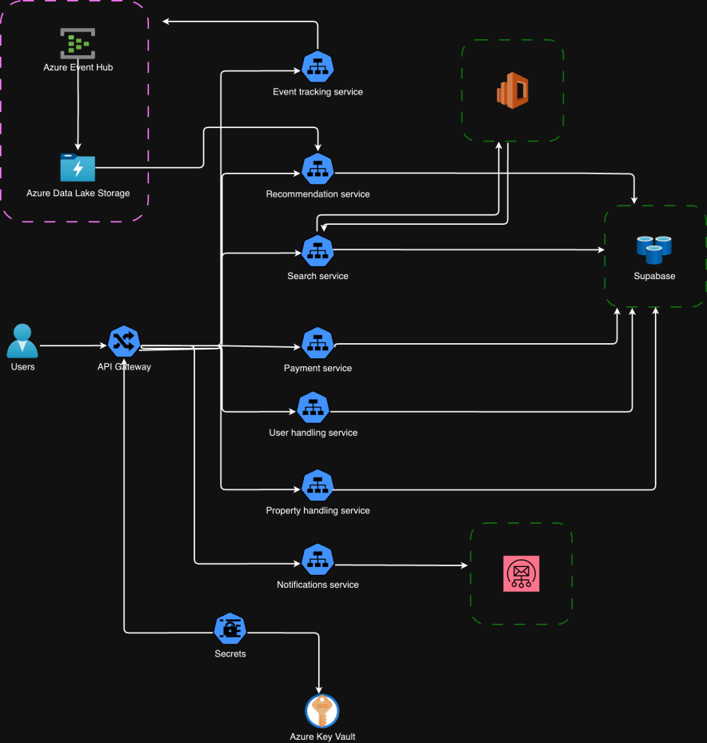

# nepremicnine.

## Računalniške storitve v oblaku, UL FRI, Ljubljana 2025
Avtorji:
- Miha Godec, mg3229@student.uni-lj.si
- Vid Potočnik, vp0583@student.uni-lj.si
- Tomaž Sagaj, ts56862@student.uni-lj.si

## nepremicnine.

nepremicnine.: Poiščite svoj popoln dom, vikend, garažo...

nepremičnine. app je platforma namenjena iskanju in oglaševanju nepremičnin, zasnovana za enostavno in hitro izkušnjo. Ne glede na to, ali iščete svoj sanjski dom, poslovni prostor ali želite svojo nepremičnino predstaviti pravim kupcem – nepremičnine so vaša idealna rešitev.

**Ključne funkcije:**

📍 Iskanje nepremičnin:
Z naprednim iskalnikom lahko poiščete nepremičnine, ki ustrezajo vašim željam. Filtrirajte rezultate po ceni, velikosti, lokaciji in tipu nepremičnine.

🔍 Pametno filtriranje:
Uporabite filtre in takoj najdite nepremičnine, ki ustrezajo vašemu okusu in proračunu.

🏡 Objavljanje nepremičnin:
Enostavno ustvarite oglase za vaše nepremičnine. Dodajte fotografije, opise in ključne podatke ter dosezite prave kupce.

📲 Opozorila:
Prejmite prilagojena obvestila na podlagi vaših preteklih iskanj in preteklih aktivnosti. Nikoli ne zamudite priložnosti za nov dom ali odlično investicijo.

🤝 Povežite se s ponudniki:
Vzpostavite stik z lastniki nepremičnin, agenti ali potencialnimi kupci.

🔐 Zasebnost in varnost:
Vaši osebni podatki so pri nas varni. Prijavite se varno s svojim e-poštnim naslovom in geslom ter nadzirajte svojo zasebnost z nastavitvami po meri.

Prenesite HomeFinder še danes in odkrijte, kako enostavno je najti ali prodati nepremičnino! 🏠✨

## Opis projekta

Projekt z naslovom nepremicnine. je nastal v sklopu predmeta Računalniške storitve v oblaku na Fakulteti za računalništvo in informatiko, Univerza v Ljubljani.

Projekt je sestavljen iz treh glavnih komponent, in sicer iz podatkovnih baz, zalednih mikrostoritev razvite v arhitekturi cloud-native in React spletne aplikacije.

### Podatkovne baze

Projekt uporablja eno podatkovno bazo, in sicer Supabase za hrambo podatkov, ki jih aplikacija potrebuje za njeno delovanje. Supabase uporablja prav tako za avtentikacijo in za hrambo datotek - slik.

Sheme vseh tabel podatkovne baze Supabase so dostopne v repozitoriju _________.

## Zaledne mikrostoritve

Projekt je sestavljen iz večih mikrostoritev, pri čemer vsaka služi svojemu namenu. Nekatere mikrostoritve služijo upravljanju in povezavi zunanjih storitev, druge zbiranju in transformiranju podatkov namenjeni kasnejši analizi in predlogom, tretje pa služijo delovanju aplikacije. Vse mikrostoritve delujejo znotraj platforme Kubernetes, ki je nameščena na ponudniku oblačnih storitev Azure.

Za namestitev in konfiguracijo infrastrukture smo uporabili orodje Terraform, ki je dostopno v repozitoriju _________. Prav tako smo se pri razvoju projekta držali dobrih praks razvoja programske opreme.

Mikrostoritve so:

- **Mikrostoritev avtentikacije:** Naloga mikrostoritve je avtentikacija uporabnikov.
- **Mikrostoritev za upravljanje z nepremičninami:**: Naloga mikrostoritve je ustvarjanje,urejanje in brisanje nepremičnin. Mikrostoritev prav tako služi poizvedovanju po mikrostoritvah.
- **Mikrostoritev za upravljanje z uporabniki:**: Naloga mikrostoritve je ustvarjanje,urejanje in brisanje uporabnikov. Mikrostoritev prav tako služi poizvedovanju po uporabnikih.
- **Mikrostoritev za logiranje in sledenje zgodovine:**: Naloga mikrostoritve je shranjevanje uporabnikove zgodovine iskanja in klikov na nepremičnino. Ti podatki kasneje služijo za ustvarjanje predlogov nepremičnin za posameznega uporabnika.
- **Mikrostoritev iskanje nepremičnin:**: Naloga mikrostoritve je iskanje in filtriranje po nepremičninah.
- **Mikrostoritev za pridobivanje lokacij:**: Naloga te mikrostoritve je zagotoviti API za lokacijske predloge in geometrijo na podlagi storitve Google Places API. 

## Uporabniški vmesnik

Projekt vsebuje spletni uporabniški vmesnik spisan v ogrodju React. Uporabniški vmesnik je  dostopen v repozitoriju ________ in na naslovu ___________.

DODAJ NEKE SLIKE??

## Arhitektura

Opomba: Opis projekta predstavlja cilj, ki smo si ga zadali. Nekaterih komponent nam žal ni uspelo vključiti oz. se končna implementacija od le tega razlikuje. Od te točke dalje opisujemo le stvari, ki so bile zahtevane, da jih naredimo.

## Zahteve

- Repozitorij [1t]
- Mikrostoritve in »cloud-native« aplikacija [6t]
- Dokumentacija [2t]
- Dokumentacija API [3t]
- Cevovod CI/CD [5t]
- Helm charts [4t]
- Namestitev v oblak [5t]
- "Serverless" funkcija [5t]
- Zunanji API [3t]
- Večnajemništvo [5t]
- Preverjanje zdravja [4t]
- GraphQL in gRPC [4t]
- Sporočilni sistemi [5t]
- Event sourcing in CQRS [5t]
- Centralizirano beleženje dnevnikov [5t]
- Zbiranje metrik [5t]
- Izolacija in toleranca napak [5t]
- Upravljanje s konfiguracijo [4t]
- Grafični vmesnik [4t]
- Vmesna predstavitev [10t]
- Terraform [3t]
- API Gateway [4t]
- Ingress Controller [4t]
- IAM, OAuth2, OIDC [4t]

## Seznam končnih točk

**Mikrostoritev avtentikacije:** 
- Registracija POST /signup
- Prijava POST /login
- Zamenjaj geslo POST POST/update_password
- Izbriši uporabnika POST /delete_user
- Pridobi uporabnika GET /auth/me
- Osveži jwt POST /refresh_token
- Pridobi zdravje mikrostoritve GET /health

**Mikrostoritev za upravljanje z nepremičninami:**:
- Ustvari nepremičnino POST /properties
- Pridobi nepremičnino GET /properties/{property_id}
- Pridobi vse nepremičnine GET /properties
- Pridobi vse uporabnikove nepremičnine GET /properties/user/{user_id}
- Izbriši nepremičnino DELETE /properties/{property_id}
- Posodobi nepremičnino PATCH /properties/{property_id}
- Pridobi zdravje mikrostoritve GET /health

**Mikrostoritev za upravljanje z uporabniki:**: 
- Pridobi uporabnika GET /users/{users_id}
- Uredi uporabnika PUT /users/{user_id}
- Ustvari uporabnika POST /users
- Pridobi zdravje mikrostoritve GET /health
- Pridobi zdravje podatkovne baze GET /health/database
- Pridobi zdravje mikrostoritve (procesor) GET /health/cpu
- Pridobi zdravje mikrostoritve (pomnilnik) GET /health/disk
- Pridobi informacijo ali je mikrostoritev živa GET /liveness
- Pridobi informacijo ali je mikrostoritev pripravljena GET /readiness

**Mikrostoritev za logiranje in sledenje zgodovine:**: 
- Ustvari iskalni zapis POST /search_log
- Ustvari zapis obiskovanja POST /visited_log
- Pridobi zdravje mikrostoritve GET /health

**Mikrostoritev iskanje nepremičnin:**: 
- Iskanje nepremičnin GET property-search/search
- Pridobi zdravje mikrostoritve GET /health

**Mikrostoritev za pridobivanje lokacij:**: 
- Pridobi predlog lokacije GET /location-autocomplete/location/suggestions
- Pridobi par lat long na pdlagi lokacije GET /location-autocomplete/location/geometry
- Pridobi zdravje mikrostoritve GET /health

## Uporabne povezave

Aplikacija je dostopna na naslovu: _______ pri čemer je vsaka mikrostoritev dostopna na svojem naslovu.

Mikrostoritev avtentikacije: _______

Mikrostoritev za upravljanje z nepremičninami: ___________

Mikrostoritev za upravljanje z uporabniki: _______

Mikrostoritev za logiranje in sledenje zgodovine: _______

Mikrostoritev iskanje nepremičnin: _______

Mikrostoritev za pridobivanje lokacij: _______

## Povezave do GitHub repozitorijev:

Dokumentacija - _____

Infrastruktura - ______

Sheme podatkovnih baz - _____

Mikrostoritev avtentikacije: _______

Mikrostoritev za upravljanje z nepremičninami: ___________

Mikrostoritev za upravljanje z uporabniki: _______

Mikrostoritev za logiranje in sledenje zgodovine: _______

Mikrostoritev iskanje nepremičnin: _______

Mikrostoritev za pridobivanje lokacij: _______

Spletna aplikacija - ______

## Povezave do Docker Hub repozitorijev:

Mikrostoritev avtentikacije: _______

Mikrostoritev za upravljanje z nepremičninami: ___________

Mikrostoritev za upravljanje z uporabniki: _______

Mikrostoritev za logiranje in sledenje zgodovine: _______

Mikrostoritev iskanje nepremičnin: _______

Mikrostoritev za pridobivanje lokacij: _______

